# DevOps_Home_Work2 (given by Mr. Vimal Daga Sir)

## Work Description :

 #### 1. Create container image that’s has Jenkins installed  using dockerfile.
 #### 2. When we launch this image, it should automatically starts Jenkins service in the container.
 #### 3. Create a job chain of job1, job2, job3 and  job4 using build pipeline plugin in Jenkins.
 #### 4. Job1 : Pull  the Github repo automatically when some developers push repo to Github.
 #### 5. Job2 : By looking at the code or program file, Jenkins should automatically start the respective language interpreter install image container to deploy code ( eg. If code is of  PHP, then Jenkins should start the container that has PHP already installed ).
 #### 6. Job3 : Test your app if it  is working or not. If app is not working , then send email to developer with error messages.
 #### 7. Job4 : If container where app is running. fails due to any reson then this job should automatically start the container again.
 
## Pre-requisite :
  * OS: Base OS is Windows 10. Server OS is RedHat Enterprise Linux 8 (RHEL8) in Virtual Box.
  * In RHEL8 some of the softwares needed are Docker (also need the php image downloaded in it), Jenkins (also github, build pipeline and email extension plugin should be installed in it).
  * In Windows we need git bash software.
  * At the starting stop the firewalld in RHEL8 and start the docker and jenkins services.
  
## Let's see step by step how to achieve this :

### 1. Creating Dockerfile and Building Personal Image using it :
   * Just see the below mentioned picture. Here I create one Dockerfile and run the build command. Remember one thing you have to run this command particularly on that folder where you **Dockerfile** exits.
   * Here is the command to build : https://github.com/raktim00/DevOps_Home_Work2/blob/master/myjenkins:v1_build_and_run_command
   * Here is the link of Dockerfile : https://github.com/raktim00/DevOps_Home_Work2/blob/master/Dockerfile
   
   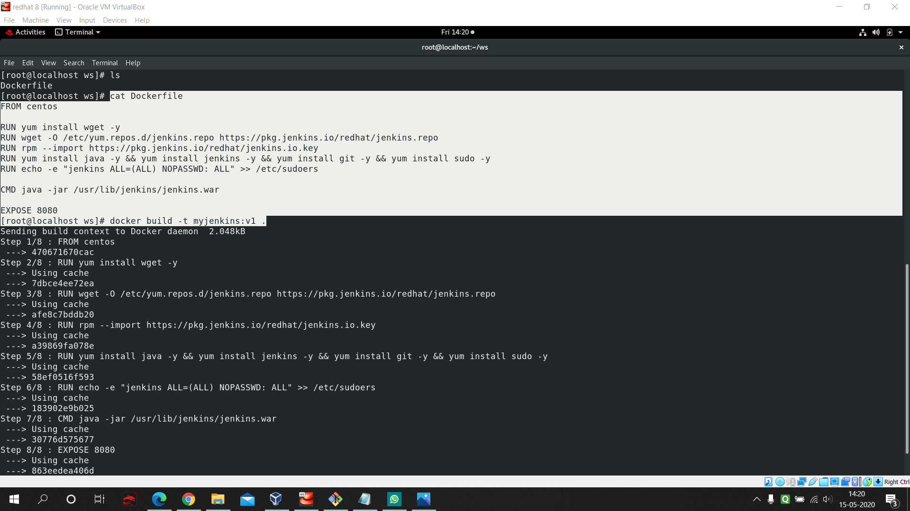
   
### 2. Running the container and collecting needed informations :
   * You can see in the below picture how to run the container. Here is the command of docker run : https://github.com/raktim00/DevOps_Home_Work2/blob/master/myjenkins:v1_build_and_run_command
   
   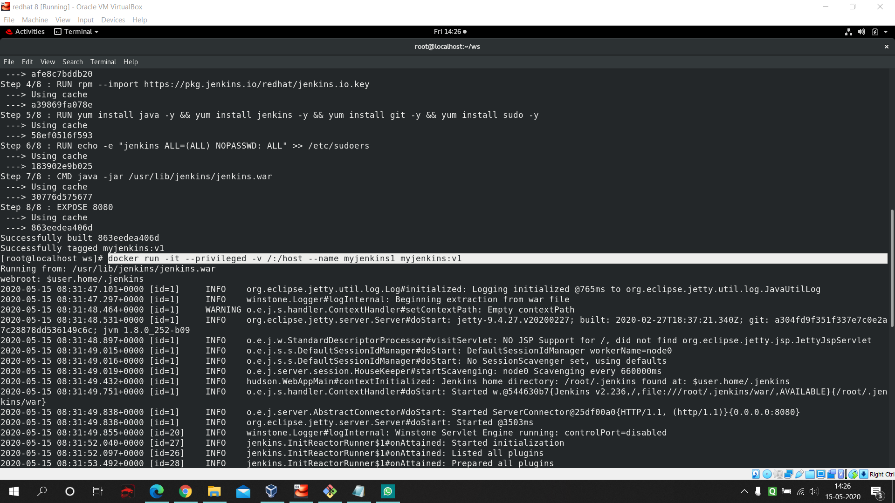
   
   * Here we have three important noticeable points.
     * 1. `"-P"` means it will go inside the image's configuration and will look for which port is exposed. It will then allocate one random port and link that with that exposed port.
     * 2. `"-v /:/host"` this command will attach our base os absolute directory to the container.
     * 3. `" --privileged"` this will allow our docker to go inside base os and from inside container we will be able to run any commands in base os.
     
 ##### Now observe this two below mentioned images :
 
 ##### Here you will find the initial password of jenkins. This is needed to unlock Jenkins for the 1st time.
 
 
   
 ##### Run these two commands `"docker ps -a"` (this is to find the allocated port number) and `"ifconfig enp0s3"` (this command will tell you the ip address of you base os.
   
 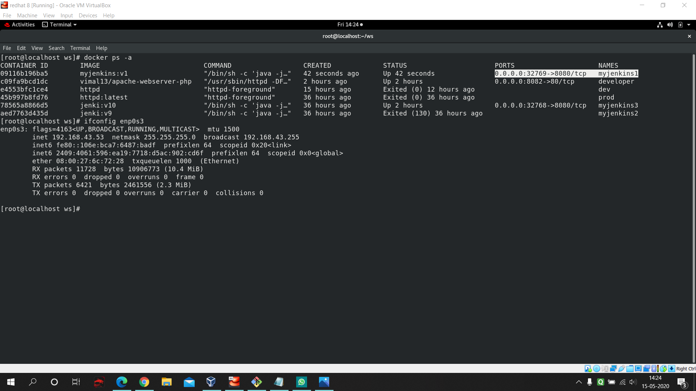
    
 ##### Now type your ip address along with port number and then copy paste the initial password in the starting page of Jenkins.
    
 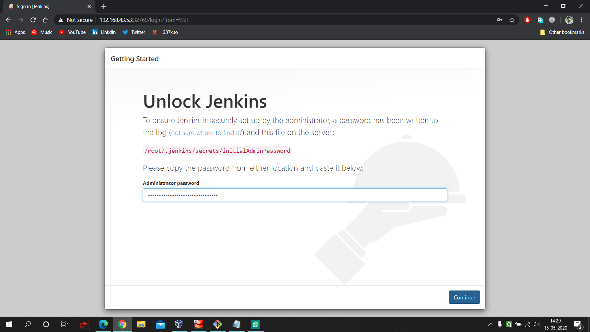
 
 ### 3. Jenkins Job1 :
 
 #### Follow the below mentioned picture and build the 1st job in Jenkins.
   * Go to the 'configure' of your job and fill these data. First give the URL of your project repository. Next in SCM select git and fill the repo URL and select the branch to dev.
   * And in build trigger just select Build Trigger Remotely and give a desired token name. This will help us to trigger jenkins as soon as we push our code to github remotely.
   
   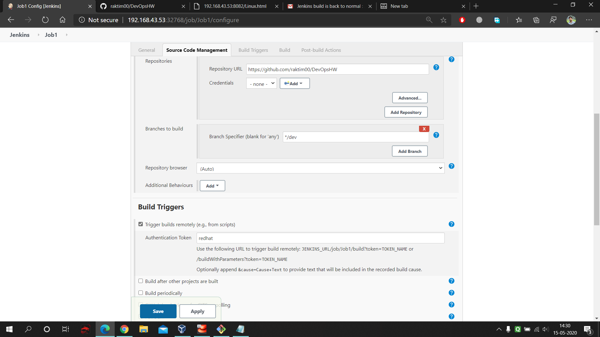
   
   * Next this is the code which gonna help to copy our files from Jenkins Workspace to our desired folder.
   
   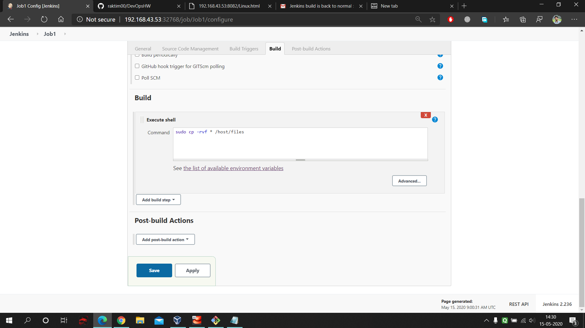
   
### 4. Jenkins Job2 :

#### Follow the below mentioned picture and build the 2nd job in Jenkins.
   * In this job we are deploying our code. Here we select one different trigger. Means as soon as job1 will complete job2 will start automatically. Also this job at first check if in our folder any php code exist or not. If yes then it will start the php container.
   
   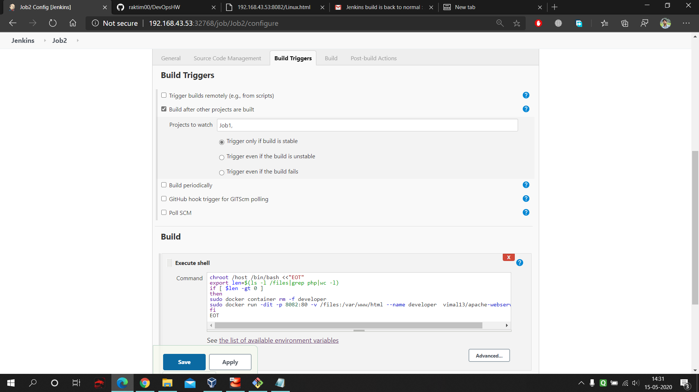
   
### 5. Jenkins Email Configuration :
#### Follow the below mentioned picture and configure your email address with Jenkins to get notifications : 
   * Goto The **Manage Jenkis** , then **Configuration** and scroll down and fill up the **email notification** portion.
   
   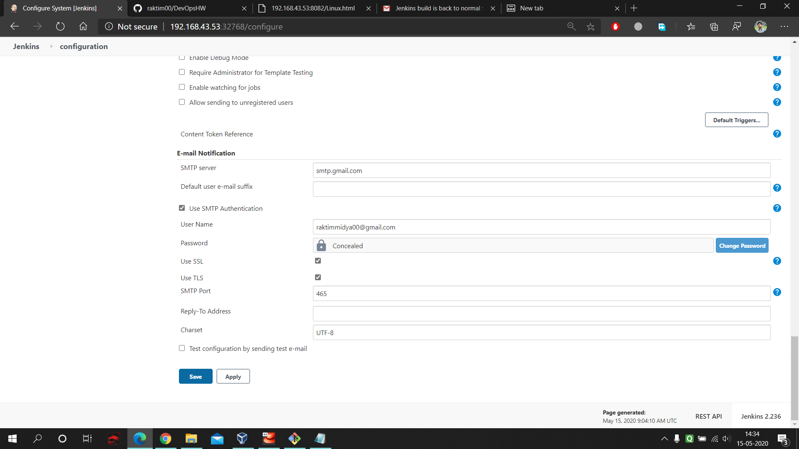
   
### 6. Jenkins Job3 :

#### Follow the below mentioned picture and build the 3rd job in Jenkins.
   * Here again use the previous trigger. This code will check if our php code is working fine or not.
   
   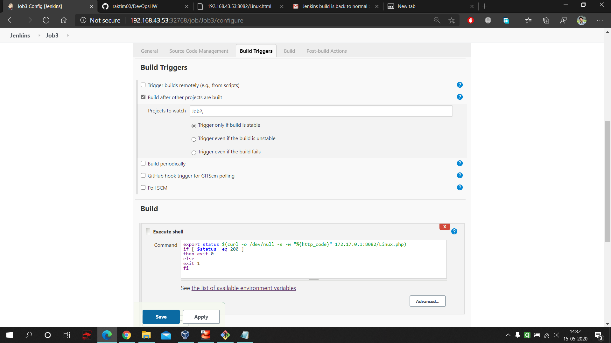
   
   * If our php code has any error then it will send notification to the developer. Follow the below picture.
   
   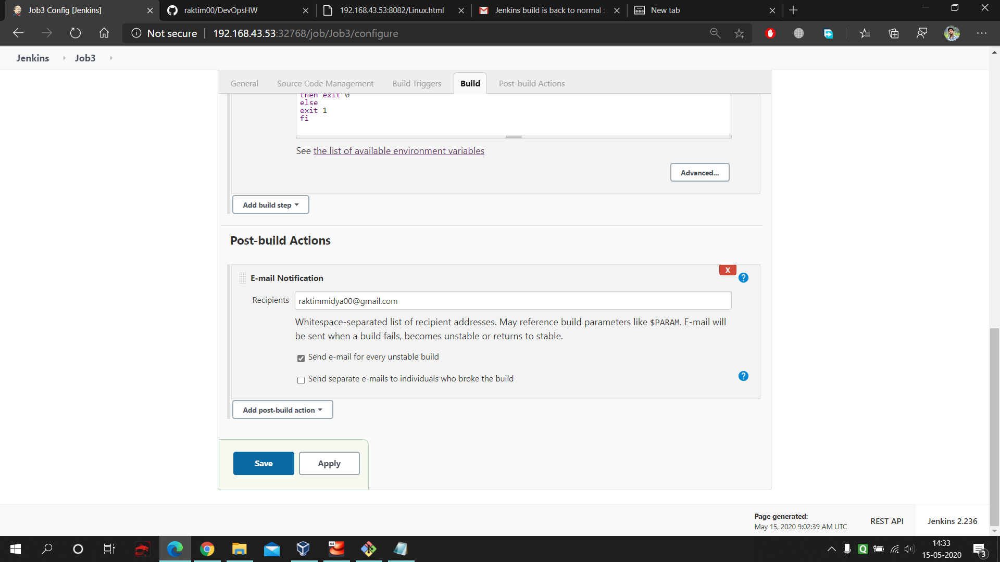
   
### 7. Jenkins Job4 :
#### Follow the below mentioned picture and build the 3rd job in Jenkins.
   * This job will keep on checking each minutes if my docker container is running or not.These 5 start means each minute this job will automatically triggers itself.
   
   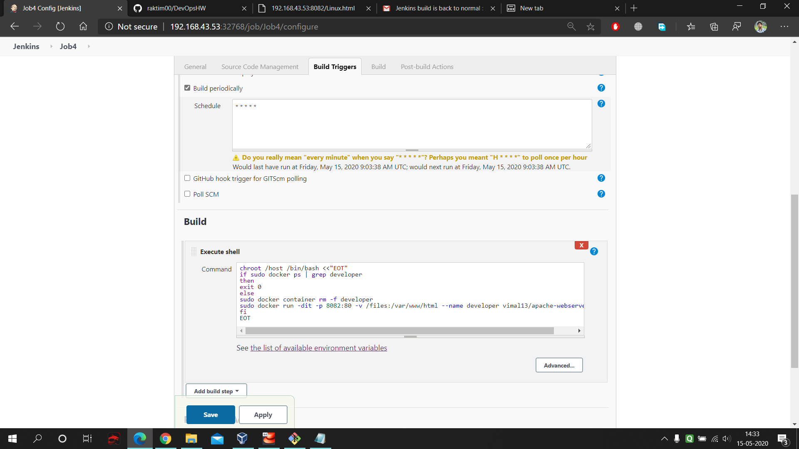
   
### 8. Creating Build Pipeline View :
   * Just simply create one new **My view** in Jenkins and select **Build Pipeline**. Then at the end only mention **job1** and you are done.
   
## So, the work is done , Now let's see how to test the setup :

#### Follow the Below pics:
   * At first pull the repo from github and go to the dev branch of it. Next configure the **post-commit**. Go inside the folder **.git/hooks** and create the post-commit. Follow the below picture and do the steps.
   
   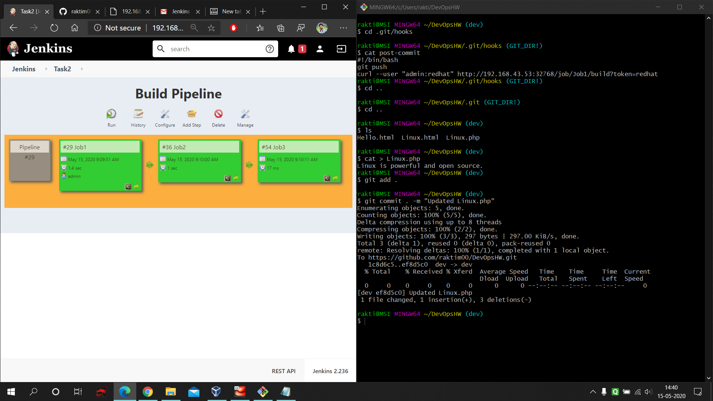
   
   * Go to the website and type your webaddress of your server and you will see the page working fine.
   
   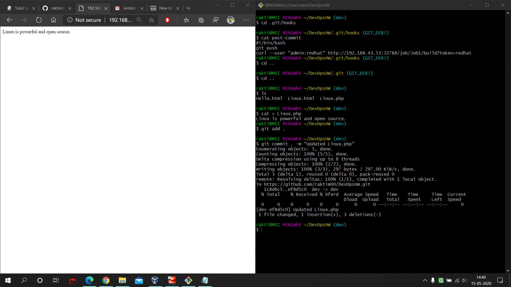
   
   * Next you can see in below picture I made one mistake in the php code. So, I pushes the wrong code. Now you will see that automatically Your Job3 will fail, that means it detects the problem.
   
   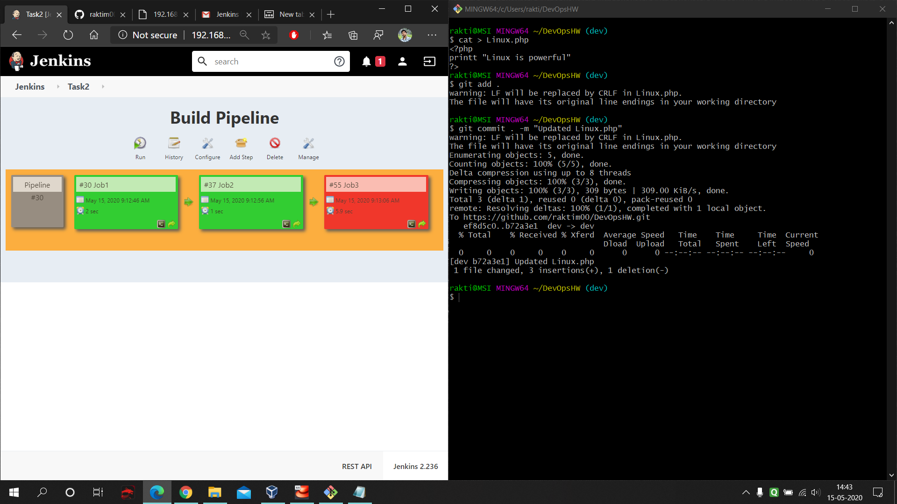
   
   * If you go to the page you will see that it's not working.
   
   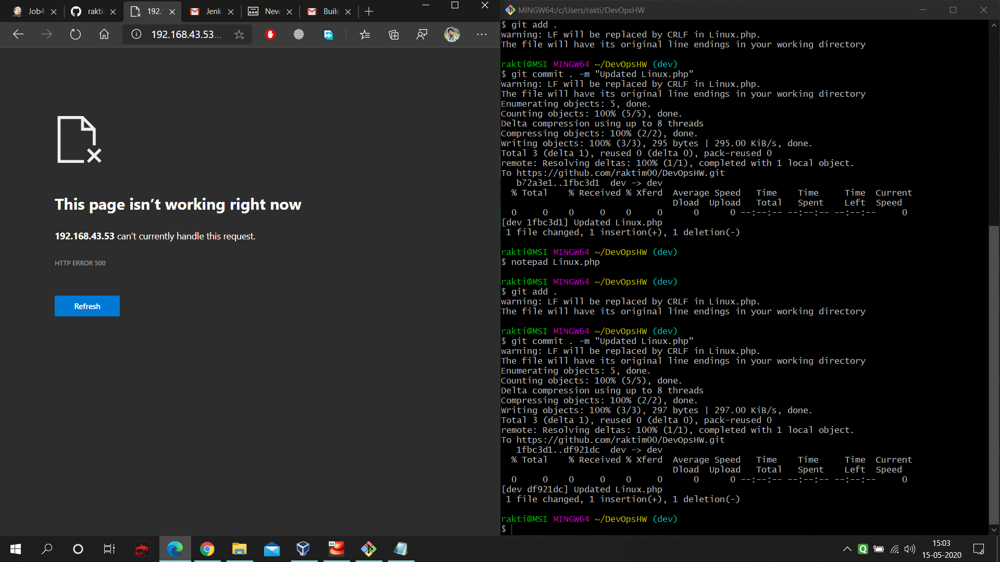
   
   * Here you can see that it sends the email notification as soon as Job3 fails.
   
   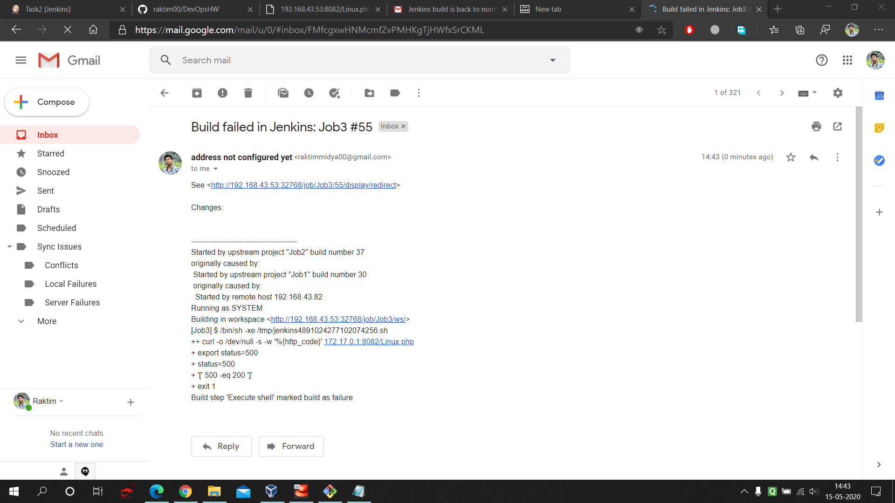
   
#### Finally one last thing let's see what our Job4 is doing :
   * If you see job4 build history you can in the below picture that it keeps on an eye on our container and if anyhow container stops it gonna start that again.
   
   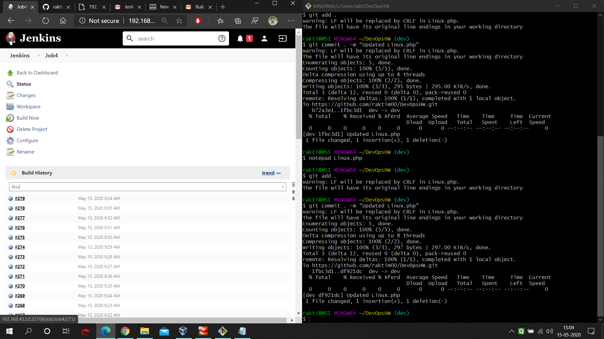
   
## Future Possibilities :

##### We can create better architecture of this practical using Kubernetes.
##### We can use this same setup in Cloud Services also.

#### Thank you so much Mr. Vimal Daga Sir for teaching us these kinds of Integrations. Also a big thank you to my friend Ashish Kumar cause he helps me to learn lots of new concepts to do this Practical.
